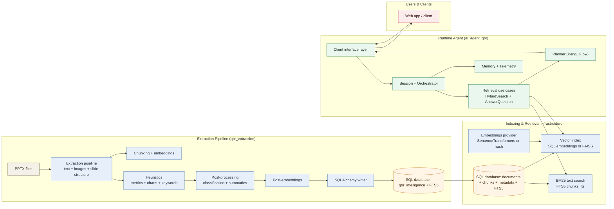
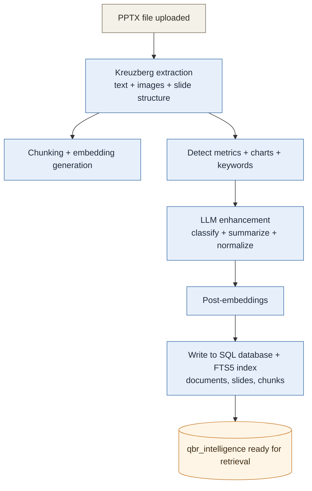
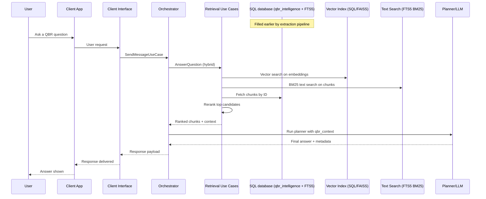

# QBR Agent Architecture and Workflows

## How This System Works

- Ingest a QBR deck, extract and chunk content, and store it in a SQL database with embeddings and FTS5 text index.
- At runtime, retrieve the most relevant chunks and use them as context to answer questions.
- Answers are grounded in retrieved QBR content.

## Architecture (High Level)

## Workflow 1: Extraction-Only (Ingestion to Database)

### What Gets Stored
- Documents + slides
- Chunks (text segments with embeddings)
- Metrics, charts, keywords, entities, images
- LLM-generated summaries and classifications (when enabled)

## Workflow 2: End-to-End (Extraction to Answer)

### Plain-English Summary
- Extraction builds a searchable knowledge base (SQL + FTS5) from PowerPoint slides.
- When a user asks a question, the agent searches both BM25 text and embeddings, reranks candidates, and then gives the LLM the most relevant slides as context.
- The client interface returns the response back to the user.

## Where This Lives in the Repo
- Extraction pipeline: `qbr_extraction/qbr_intelligence/pipeline/processor.py`
- Runtime agent orchestration: `src/ai_agent_qbr/orchestrator.py`
- Retrieval use cases: `src/qbr_agent/application/use_cases.py`
- Storage & vector index: `src/qbr_agent/infrastructure/`
- Client interface layer: `src/ai_agent_qbr/transport/`
