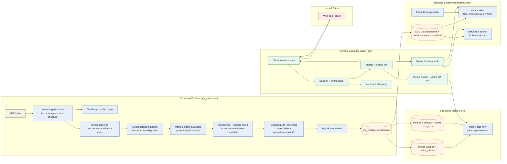
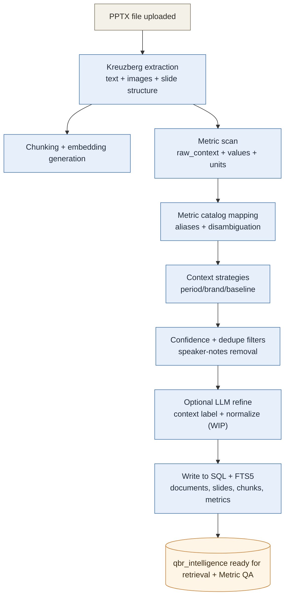
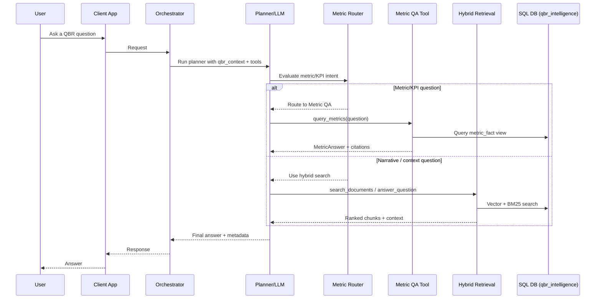
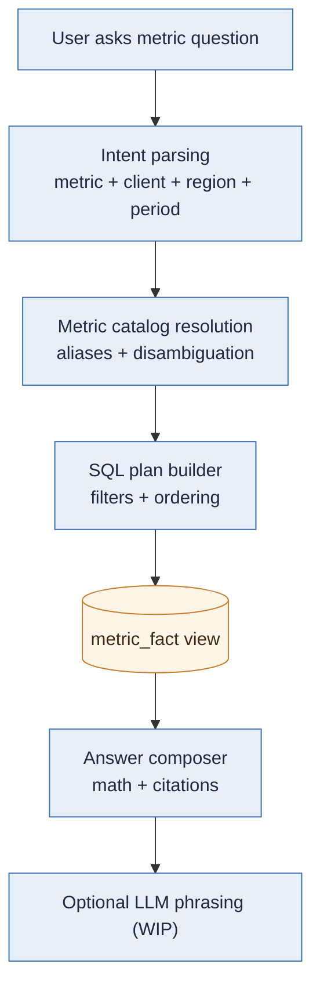

# QBR Agent Architecture and Workflows (v2)

## How This System Works (v2)

- Ingest a QBR deck, extract text/structure, and build two knowledge stores:
  - Unstructured chunk store (embeddings + FTS5 BM25) for semantic retrieval.
  - Structured metric store (metric catalog + metric facts) for deterministic metric QA.
- At runtime, the planner routes metric/KPI questions to Metric QA, and uses hybrid retrieval
  (embeddings + BM25) for narrative, insight, or slide-context questions.
- Optional LLM enrichment exists for metric refinement and context labeling, but is still WIP
  and gated by configuration.

## Architecture (High Level)

## Workflow 1: Extraction + Knowledge Build (Ingestion to Database)

### Confidence & Selection Strategies (Metric Pipeline)
- Use metric catalog and aliases to resolve metric names and disambiguation tokens.
- Prefer candidates with higher `extraction_confidence`; tie-break by richer `raw_context`.
- Drop metrics sourced only from speaker notes or empty/duplicate contexts.
- Apply rule-based period/brand/baseline extraction (with optional LLM refinement).

## Workflow 2: Runtime Answering (Planner Routes to the Right Retrieval)

### Metric QA: How It Works
- A deterministic engine builds a `metric_fact` view by joining metrics with catalog, periods,
  clients, and regions.
- The intent parser resolves metric IDs, client/region, and period filters.
- The query planner applies filters, ordering, and aggregation (latest, trend, compare, avg, sum).
- The answer composer returns a structured answer plus citations (document_id, slide_id).
- Optional LLM phrasing is gated and currently WIP.

### Planner Routing: Metric QA vs Semantic Search
- Metric/KPI questions (values, trends, period comparisons) are routed to `query_metrics` first.
- Open-ended narrative or qualitative questions use hybrid retrieval (embeddings + BM25).
- If structured metric intent fails or is ambiguous, the planner can fall back to hybrid search
  and ask for clarifications.

## Workflow 3: Metric QA (Structured Retrieval)

## WIP: Document Path and Slide Links
- Current retrieval returns document metadata only; it does not resolve Google Slides URLs.
- Planned: connect to Google Slides API, map document -> slide IDs, and return a concrete
  slide link per citation.
- The agent currently includes `document_url` only if already stored in the DB.

## Where This Lives in the Repo
- Extraction pipeline: `qbr_extraction/qbr_intelligence/pipeline/processor.py`
- Metric context strategies: `qbr_extraction/qbr_intelligence/pipeline/metric_context.py`
- Metric QA engine: `qbr_extraction/qbr_intelligence/metric_qa/`
- Runtime orchestrator: `src/ai_agent_qbr/orchestrator.py`
- Metric router + tool: `src/ai_agent_qbr/infrastructure/metric_router.py`, `src/ai_agent_qbr/tools/query_metrics.py`
- Hybrid retrieval use cases: `src/qbr_agent/application/use_cases.py`
