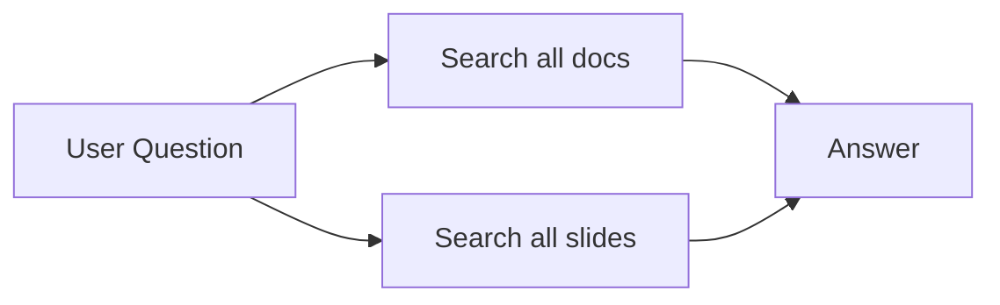
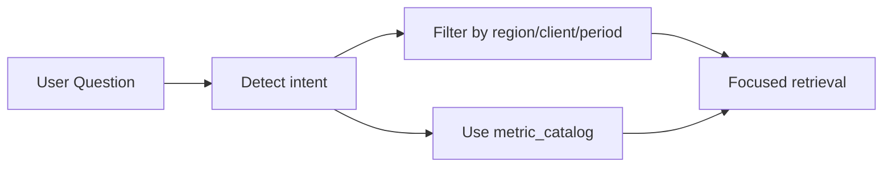
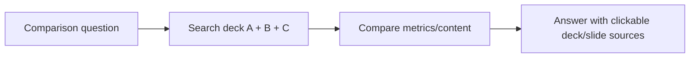
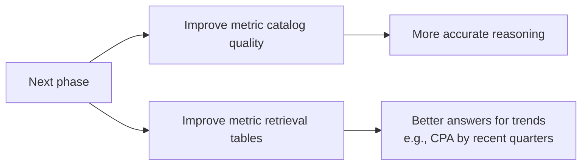
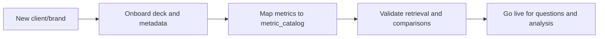

# QBR Progress

## Step 1: Broad Search Proof of Concept

- First, we searched across all documents and all slides.
- This proved the concept and showed end-to-end value quickly.
- However, comparison use cases exposed limits in precision.
- Because context was too broad, noisy matches could reduce answer quality.

## Step 2: Intent-Based Narrowing + Metric Catalog

- Then, we narrowed context using user intent.
- We added filters for region, brand/client, and time period.
- In parallel, we added `metric_catalog` for business metric values.
- As a result, retrieval became more focused and reliable.

## Step 3: Multi-Deck Search + Source Links

- After that, we introduced multi-deck search.
- This enabled controlled comparisons across periods, regions, and clients/brands.
- We also added clickable deck and slide source links.
- Therefore, answers became easier to validate and trust.

## Step 4: Next Improvements

- Next, we will improve metric catalog quality.
- This should improve reasoning accuracy over business metric patterns.
- We will also improve metric retrieval output format.
- For example, we want table-style answers for trends like CPA across recent quarters.

## Step 5: Adding New Clients/Brands

- After that, we will scale by adding new clients and brands.
- We will onboard their decks and connect their metrics to `metric_catalog`.
- We will validate that comparisons and sources stay accurate.
- This will expand coverage while keeping the same product experience.
